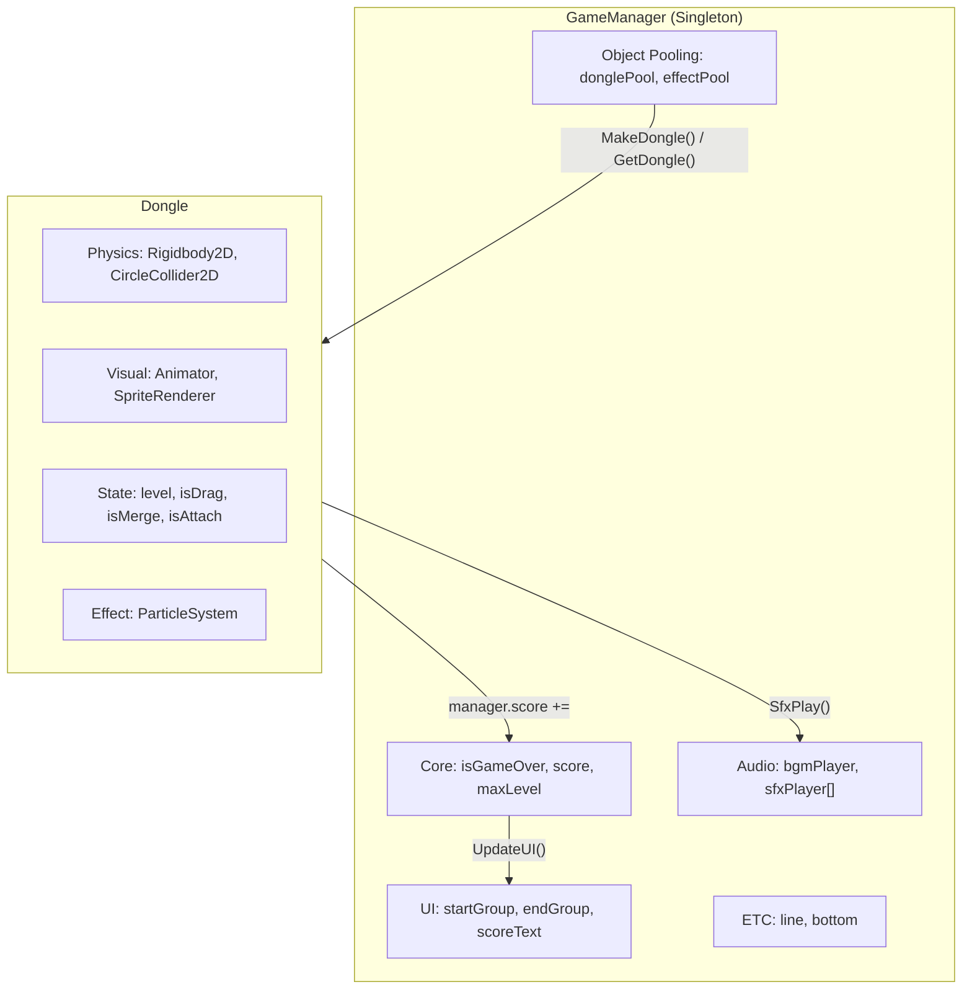
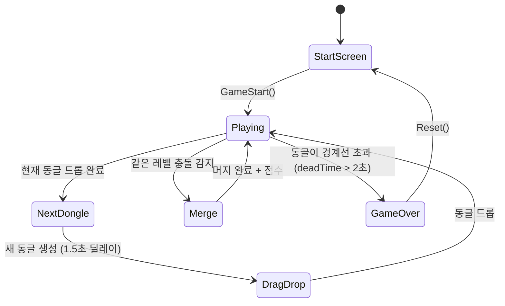
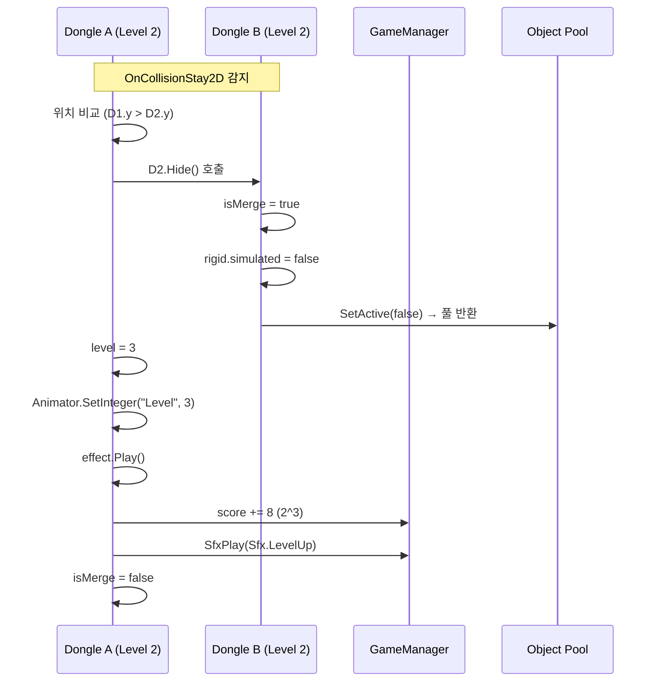

# Architecture

## 게임 아키텍처

### 전체 구조



### 게임 루프



### 머지 로직 상세

`Dongle.cs`의 `OnCollisionStay2D`에서 머지를 처리합니다:

```
OnCollisionStay2D(collision):
  other = collision.gameObject.GetComponent<Dongle>()
  
  조건 체크:
    - other가 null이 아닌가
    - 같은 레벨인가 (level == other.level)
    - 둘 다 isMerge가 false인가
    - maxLevel에 도달하지 않았는가
  
  머지 실행:
    1. 위치가 높은(y가 큰) 동글이 머지 주체
    2. 흡수되는 동글:
       - isMerge = true
       - 물리 비활성화
       - SetActive(false) → 풀로 반환
    3. 머지 주체:
       - isMerge = true
       - level += 1
       - Animator.SetInteger("Level", level)
       - 파티클 이펙트 재생
       - manager.score += (int)Mathf.Pow(2, level)
       - SfxPlay(Sfx.LevelUp)
       - isMerge = false (다음 머지 가능)
```



### 동글 생명주기

```
MakeDongle():
  Instantiate(donglePrefab) → donglePool에 추가
  Instantiate(effectPrefab) → effectPool에 추가
  초기 상태: SetActive(false)

GetDongle():
  poolCursor 기반으로 비활성 동글 검색
  찾으면 → SetActive(true) 후 반환
  없으면 → MakeDongle() 후 반환

NextDongle():
  1.5초 딜레이 후 호출
  GetDongle()으로 동글 획득
  level = Random.Range(0, maxLevel)
  manager.lastDongle = this
  isDrag = true (드래그 대기)

Drop():
  isDrag = false
  rigid.simulated = true (물리 활성화)

OnDisable():
  모든 상태 초기화:
  level = 0, isDrag = false, isMerge = false
  위치/회전/스케일 리셋
  rigid.velocity = Vector2.zero
```

### 게임 오버 감지

동글이 바닥에 닿지 않고 상단에 머물면 `deadTime`이 증가합니다:

```
동글의 Update() 내부:
  if isAttach && !isMerge && 게임 진행 중:
    deadTime += Time.deltaTime
    if deadTime > 2f:
      → GameManager.GameOver() 호출
```

### 오브젝트 풀링 상세

```csharp
// GameManager.Awake()
Application.targetFrameRate = 60;
donglePool = new List<Dongle>();
effectPool = new List<ParticleSystem>();
for (int i = 0; i < poolSize; i++) {
    MakeDongle();
}
```

풀 사이즈(`poolSize`)는 인스펙터에서 1~30 범위로 조절 가능합니다 (`[Range(1, 30)]` 어트리뷰트).

### PlayerPrefs 데이터

```
Key: "MaxScore" → int (최고 점수)
```

게임 시작 시 `PlayerPrefs.HasKey` 확인, 없으면 0으로 초기화. 게임 오버 시 현재 점수가 최고 점수보다 높으면 갱신합니다.
